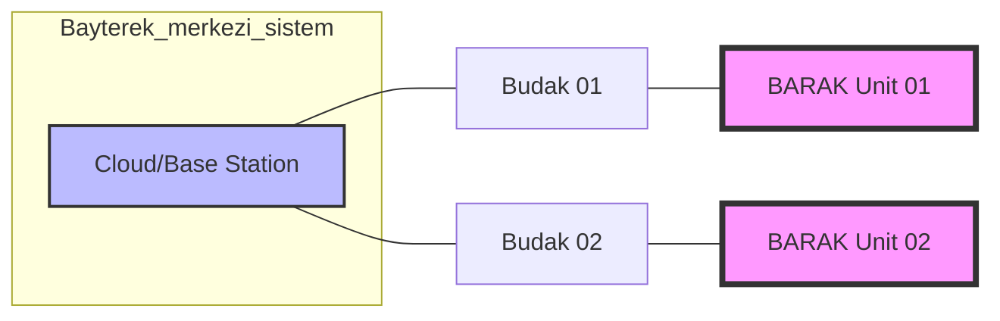

# 🐾 BARAK: Hibrit Mobilite ve Otonom Keşif Sistemi


<div align="center">

[](https://docs.ros.org/en/humble/index.html)
[](https://opensource.org/licenses/MIT)
[]()
[](https://github.com/arch-yunus)

</div>

**BARAK**, Türk mitolojisindeki efsanevi ve çevik yaratıktan esinlenilerek geliştirilen; hava, kara ve su mecralarında kesintisiz operasyon kabiliyetine sahip bir **Multi-Modal Otonom Platformdur**. 

Bu proje, **Meta-Engineering Research Lab (MERL)** bünyesinde, en zorlu coğrafi koşullarda bile "görev kritik" (mission-critical) süreklilik sağlamak amacıyla tasarlanmıştır.

---

## 🐺 Kozmolojik Mimari: Bayterek ve Budak

Türk kozmolojisinde dünya, kökleri göğün yedi kat derinine, dalları ise sonsuzluğa uzanan **Bayterek (Hayat Ağacı)** tarafından dengelenir. **BARAK**, bu ağacın koruyucusu ve üç alem (Gök, Yer, Su) arasındaki tek elçidir.

*   **Bayterek (Sistem Topolojisi):** Tüm otonom birimlerin bağlı olduğu merkezi veri ağacı.
*   **Budak (Edge-AI):** Bayterek'in her bir birime uzanan uç noktası. BARAK'ın yerel zekasını temsil eder.



---

## 🏗️ Teknik Derin Bakış: ROS2 Modüler Ekosistem

BARAK sistemi, yüksek modülerlik ve hata payını minimize eden bir ROS2 yapısı üzerine kurulmuştur.

### 📦 Paket Dağılımı

1.  **`barak_common` (Interfaces):**
    - Sistemin ortak dilini konuşur. `HybridState` ve `Telemetry` gibi özel mesaj tiplerini içerir.
    - Tüm modüller arasındaki veri tutarlılığını sağlar.

2.  **`barak_perception` (Mergen-Vision):**
    - **Algılama:** TensorRT ve OpenVINO ile optimize edilmiş derin öğrenme modellerini çalıştırır.
    - **Zemin Analizi:** Arazi tipini (Kar/Su/Toprak) mikro saniyeler içinde analiz ederek navigasyon katmanına "kabiliyet kısıtı" raporlar.

3.  **`barak_navigation` (Umay-Core):**
    - **Gök-Yer-Su Rotası:** Klasik Nav2 paketlerinin ötesinde, 3D uzay ve su yüzeyi fiziğini anlık olarak rota planlamasına dahil eder.

4.  **`barak_locomotion` (Toghrul-Drive):**
    - **Hibrit Aktüasyon:** Palet torku ile pervane devri arasındaki geçişi yönetir. "Amfibik Mod" ve "VTOL Mod" geçişleri burada gerçekleşir.

5.  **`barak_comms` (Security Layer):**
    - **Kadim Anahtar:** MERL tarafından geliştirilen, uçtan uca şifrelenmiş ve RSA/AES tabanlı güvenli haberleşme katmanı.

6.  **`barak_description` & `barak_simulation`:**
    - Sistemin dijital ikizini (URDF/Xacro) ve Gazebo Harmonic üzerindeki fiziksel simülasyon ortamlarını barındırır.

---

## 🛡️ Güvenlik Protokolleri (Security by Design)

Otonom sistemlerde "siber-fiziksel" güvenlik, tasarımın bir parçası olmalıdır. BARAK, her telemetri verisini bir **"Kadim Anahtar"** (Unique Signature) ile imzalar.

```python
# barak_comms örneği
telemetry_msg.encrypted_payload = base64.b64encode(raw_data).decode()
telemetry_msg.signature = hashlib.sha256((encrypted + secret_key).encode()).hexdigest()
```

---

## 🚀 Öne Çıkan Özellikler ve Mod Değişimi

| Mod | İtki Sistemi | Meera / Ortam | Öncelik |
| :--- | :--- | :--- | :--- |
| **Terrestrial** | All-Terrain Palet | Kar, Çamur, Kaya | Tork ve Denge |
| **Aerial** | Quad-Propeller (VTOL) | Atmosferik Keşif | Hız ve Görüş Alanı |
| **Maritime** | Amfibik Jet İtki | Sığ Su, Bataklık | Sızdırmazlık ve Stabilite |

---

## 💻 Teknoloji Yığını (Tech Stack)

### Donanım Teknik Özellikleri
| Bileşen | Model | Açıklama |
| :--- | :--- | :--- |
| **Compute Node** | NVIDIA Jetson Orin Nano | 40 TOPS AI Performansı |
| **Flight Controller** | Pixhawk 6C | PX4 Autopilot Stack |
| **LiDAR** | Ouster OS1 (32 Channel) | 120m Menzilli 3D Haritalama |
| **Visual Depth** | Intel RealSense D435i | Engel Sakınma ve SLAM |
| **Chassis** | Carbon Fiber Reinforced | Hafif ve Yüksek Dayanımlı |

---

## ⚡ Simülasyon ve Deploy

### Simülasyonu Başlatma
Dijital ikizi RViz ve Gazebo üzerinde görüntülemek için:
```bash
ros2 launch barak_bringup barak_system.launch.py
```

### Budak Optimizasyonu
Modelleri Jetson üzerinde derlemek için:
```bash
# src/barak_perception içinde
python3 tools/optimize_model.py --model perception_v4.onnx --target tensorrt
```

---

## ⚖️ Sorumlu Otonomi (Ethical AI)

BARAK projesi, **MERL Otonomi İlkeleri** uyarınca geliştirilmiştir:
1.  **Human-in-the-Loop:** Kritik karar anlarında insan operatör denetimi.
2.  **Fail-Safe:** İletişim kaybı durumunda "En Yakın Güvenli Nokta" (Safety Point) navigasyonu.
3.  **Veri Gizliliği:** Keşif verilerinin yerel işlenmesi (Edge-AI) ve gizliliği.

---

## 🗺️ Geliştirme Yol Haritası

- [x] **Faz 0:** Mimari tasarım ve ROS2 iskelet kurulumu.
- [/] **Faz 1:** Karbon-fiber takviyeli hafifletilmiş palet mekanizmasının üretimi.
- [ ] **Faz 2:** Arazi tipine göre enerji tüketimini optimize eden "Dynamic Power Switching" algoritması.
- [ ] **Faz 3:** Su altı sonar sensörleri ile sığ su navigasyonu eklenmesi.
- [ ] **Faz 4:** "Monk Mode" otonomi; dış müdahale olmadan 48 saatlik keşif görevi senaryosu.

---

## 🤝 Katkıda Bulunma ve Ekip
**Meta-Engineering Research Lab (MERL)** olarak otonomi ve robotik tutkunlarını aramızda görmekten mutluluk duyarız.

📧 **İletişim:** [info@merl.lab](mailto:info@merl.lab)  
🌐 **Lab:** [github.com/arch-yunus](https://github.com/arch-yunus)

---

## 📜 Lisans
Bu proje **MIT Lisansı** altında lisanslanmıştır. © 2026 MERL.
