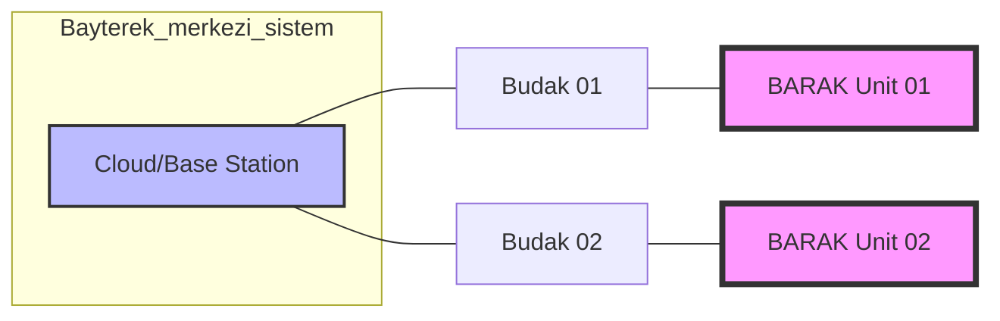

# 🐾 BARAK: Hibrit Mobilite ve Otonom Keşif Sistemi


<div align="center">

[](https://docs.ros.org/en/humble/index.html)
[](https://opensource.org/licenses/MIT)
[]()
[](https://github.com/arch-yunus)

</div>

**BARAK**, Türk mitolojisindeki efsanevi ve çevik yaratıktan esinlenilerek geliştirilen; hava, kara ve su mecralarında kesintisiz operasyon kabiliyetine sahip bir **Multi-Modal Otonom Platformdur**. 

Bu proje, **Meta-Engineering Research Lab (MERL)** bünyesinde, en zorlu coğrafi koşullarda bile "görev kritik" (mission-critical) süreklilik sağlamak amacıyla tasarlanmıştır.

---

## 🐺 Kozmolojik Mimari: Bayterek ve Budak

Türk kozmolojisinde dünya, kökleri göğün yedi kat derinine, dalları ise sonsuzluğa uzanan **Bayterek (Hayat Ağacı)** tarafından dengelenir. **BARAK**, bu ağacın koruyucusu ve üç alem (Gök, Yer, Su) arasındaki tek elçidir.

*   **Bayterek (Sistem Topolojisi):** Tüm otonom birimlerin bağlı olduğu merkezi veri ağacı.
*   **Budak (Edge-AI):** Bayterek'in her bir birime uzanan uç noktası. BARAK'ın yerel zekasını temsil eder.



---

## 🏗️ Teknik Derin Bakış: ROS2 Modüler Ekosistem

BARAK sistemi, yüksek modülerlik ve hata payını minimize eden bir ROS2 yapısı üzerine kurulmuştur.

### 🍱 Depo Hiyerarşisi (Detailed File Tree)
```text
BARAK/
├── assets/                 # Görsel materyaller ve bannerlar
├── firmware/               # PX4 parametreleri ve ESC konfigürasyonları
├── hardware/               # Karbon fiber şasi CAD ve 3D çizimler
├── src/
│   ├── barak_common/       # Ortak arayüzler ve mesaj tipleri (msg/)
│   ├── barak_perception/   # Mergen-Vision: AI çıkarım motoru (Python)
│   ├── barak_navigation/   # Umay-Core: Hibrit rota planlama
│   ├── barak_locomotion/   # Toghrul-Drive: Aktüatör ve mod kontrolü
│   ├── barak_comms/        # Sistem içi ve dışı güvenli haberleşme
│   ├── barak_description/  # Robot URDF/Xacro ve 3D modeller (meshes/)
│   ├── barak_bringup/      # Sistem genelini ayağa kaldıran launch dosyaları
│   └── barak_simulation/   # Gazebo ve fiziksel dünya parametreleri
```

### 📦 Paket Fonksiyonları

1.  **`barak_common`**: `HybridState.msg` (Mod bilgisi, Batarya) ve `Telemetry.msg` (Şifreli veri) tiplerini içerir.
2.  **`barak_perception`**: Mergen-Vision: Jetson Orin üzerinde **TensorRT** optimizasyonuyla düşük gecikmeli nesne tanıma gerçekleştirir.
3.  **`barak_navigation`**: Umay-Core: Zemin tipine (Bataklık, Kar, Açık Hava) göre dinamik maliyet haritası (costmap) oluşturur.
4.  **`barak_locomotion`**: Toghrul-Drive: Pervanelerin su altı jeti mi yoksa uçuş pervanesi mi olarak çalışacağına karar verir.
5.  **`barak_comms`**: RSA imzalı paketler ile elektronik harbe karşı direnç sağlar.

---

## 🗺️ Operasyonel Senaryolar (Use-Cases)

### 🏔️ Arama-Kurtarma (SAR)
Sarp ve karlı arazilerde, paletleri sayesinde ilerlerken, ulaşılamayan uçurum kenarlarına drone moduna geçerek (VTOL) iniş yapabilir.
- **Hedef:** Isı imzası tespiti ve acil yardım kiti teslimatı.

### 🌊 Bataklık ve Kıyı Gözlemi
Sığ suların ve bataklıkların olduğu bölgelerde (Amfibik mod), batmadan ilerleyebilir ve su yüzeyinden veri toplayabilir.
- **Hedef:** Çevresel kirlilik analizi ve kıyı sınır güvenliği.

### 🏙️ Şehir Dışı Otonom Keşif
"Monk Mode" özelliği ile 48 saatlik kesintisiz, insan müdahalesi olmadan keşif görevleri yürütebilir.
- **Hedef:** Stratejik bölgelerin haritalandırılması.

---

## 🔌 API ve Topic Referansı

| Topic | Mesaj Tipi | Yayımlayan | Açıklama |
| :--- | :--- | :--- | :--- |
| `/barak/terrain_info` | `HybridState` | `barak_perception` | Analiz edilen zemin ve mod önerisi. |
| `/barak/global_path` | `nav_msgs/Path` | `barak_navigation` | Mevcut mod için planlanan rota. |
| `/barak/current_status`| `HybridState` | `barak_locomotion` | Sistemin aktif modu ve donanım sağlığı. |
| `/barak/secure_telemetry`| `Telemetry` | `barak_comms` | Şifrelenmiş ve imzalanmış telemetri paketi. |
| `/cmd_vel` | `geometry_msgs/Twist` | `barak_navigation` | Motor ve pervane hızı komutları. |

---

## 🛡️ Güvenlik ve Acil Durum (Fail-Safe) Protokolleri

BARAK, kritik durumlarda otonom karar vererek platformun güvenliğini sağlar:

1.  **İletişim Kaybı (Comms Lost):** 30 saniye boyunca baz istasyonuna bağlanamazsa, otonom olarak `RTH` (Return to Home) protokolünü başlatır.
2.  **Kritik Batarya Seviyesi (<15%):** Görevi iptal eder ve olduğu yere güvenli iniş (Safe Landing) veya üsse dönüş yapar.
3.  **Zemin Değişimi:** Mergen-Vision, paletli ilerlemenin riskli olduğu bir zemin tespit ederse (örn. aşırı derin su), sistemi otomatik olarak uçuş moduna geçirir.

---

## 🧠 Budak AI: TensorRT Optimizasyon Akışı

Perception katmanında kullanılan modellerin optimizasyon süreci:
1.  **Eğitim:** PyTorch/TensorFlow ortamında özel veri setleri (Kar/Su/Arazi) ile eğitim.
2.  **Export:** Modelin **ONNX** formatına dönüştürülmesi.
3.  **Optimization:** Jetson üzerinde **TensorRT** motoru oluşturulması (FP16/INT8 Quantization).
4.  **Deployment:** `barak_perception` üzerinden 60+ FPS ile gerçek zamanlı çıkarım.

---

## 💻 Teknoloji Yığını (Tech Stack)

### Donanım Teknik Özellikleri
| Bileşen | Model | Açıklama |
| :--- | :--- | :--- |
| **Compute Node** | NVIDIA Jetson Orin Nano | 40 TOPS AI Performansı |
| **Flight Controller** | Pixhawk 6C | PX4 Autopilot Stack |
| **LiDAR** | Ouster OS1 (32 Channel) | 120m Menzilli 3D Haritalama |
| **Visual Depth** | Intel RealSense D435i | Engel Sakınma ve SLAM |
| **Chassis** | Carbon Fiber Reinforced | Hafif ve Yüksek Dayanımlı |

---

## ⚡ Simülasyon ve Deploy

### Simülasyonu Başlatma
Sistemi tek bir komutla ayağa kaldırmak için:
```bash
ros2 launch barak_bringup barak_system.launch.py
```

### Fizik Motoru Ayarları
Gazebo üzerinde su ve kar direncini kalibre etmek için `barak_simulation/config/physics.yaml` dosyasını düzenleyebilirsiniz.

---

## ⚖️ Sorumlu Otonomi (Ethical AI)

BARAK projesi, **MERL Otonomi İlkeleri** uyarınca geliştirilmiştir:
1.  **Human-in-the-Loop:** Kritik karar anlarında insan operatör denetimi.
2.  **Fail-Safe:** Beklenmedik durumlarda önceden tanımlı güvenli davranış.
3.  **Veri Gizliliği:** "Edge-first" veri işleme yaklaşımı ile gizlilik koruması.

---

## 🤝 Katkıda Bulunma ve Ekip
**Meta-Engineering Research Lab (MERL)** olarak otonomi ve robotik tutkunlarını aramızda görmekten mutluluk duyarız.

📧 **İletişim:** [info@merl.lab](mailto:info@merl.lab)  
🌐 **Lab:** [github.com/arch-yunus](https://github.com/arch-yunus)

---

## 📜 Lisans
Bu proje **MIT Lisansı** altında lisanslanmıştır. © 2026 MERL.
