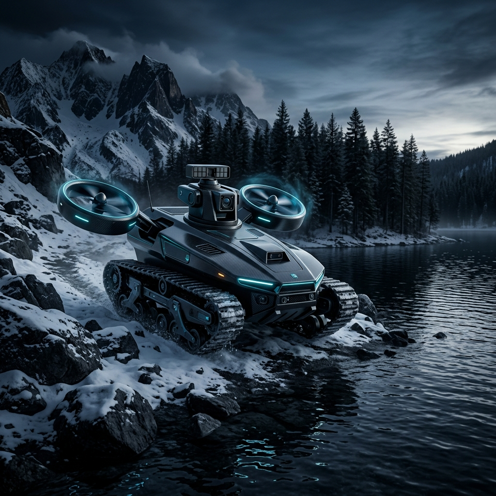
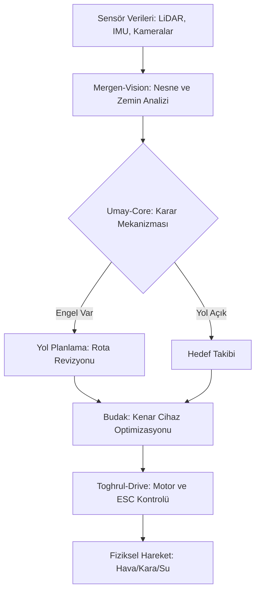

# 🐾 BARAK: Hibrit Mobilite ve Otonom Keşif Sistemi



<div align="center">

[](https://docs.ros.org/en/humble/index.html)
[](https://opensource.org/licenses/MIT)
[]()
[](https://github.com/arch-yunus)

</div>

**BARAK**, Türk mitolojisindeki efsanevi ve çevik yaratıktan esinlenilerek geliştirilen; hava, kara ve su mecralarında kesintisiz operasyon kabiliyetine sahip bir **Multi-Modal Otonom Platformdur**. 

Bu proje, **Meta-Engineering Research Lab (MERL)** bünyesinde, en zorlu coğrafi koşullarda bile "görev kritik" (mission-critical) süreklilik sağlamak amacıyla tasarlanmıştır.

---

## 🐺 Mitolojik Arka Plan
Türk kozmolojisinde dünya üç katmandan oluşur. **BARAK**, bu katmanlar arasında form değiştirmeden hareket edebilen nadir bir iradeyi temsil eder:
* **Gök (Hava):** Kanatlanıp süzülen bir kartal kadar özgür.
* **Yer (Kara):** En sarp kayalıkları ve karlı ovaları aşan paletli bir kurt.
* **Su:** Ak Ana'nın diyarında yolunu bulan amfibik bir güç.

---

## 🏗️ Teknik Mimari ve "Budak" Entegrasyonu

BARAK, gücünü sadece mekanik yapısından değil, **Budak | Edge-AI Optimization** katmanından alır.

### 🧠 Akıllı Katmanlar
1.  **Umay-Core (Navigasyon):** ROS2 Humble üzerinde koşan, otonom rota planlama ve engelden sakınma algoritması.
2.  **Mergen-Vision (Algılama):** Pruning ve Quantization işlemlerinden geçmiş, düşük gecikmeli nesne tanıma sistemi. Arazi tipini (Kar/Su/Toprak) mikro-saniyeler içinde analiz eder.
3.  **Toghrul-Drive (Kontrol):** Pervane devri ile palet torku arasındaki hassas dengeyi sağlayan hibrit sürücü mimarisi.

### 🛠️ Sistem Akış Şeması


---

## 🚀 Öne Çıkan Özellikler

| Özellik | Tanımlama |
| :--- | :--- |
| **Amfibik İtki** | Su yüzeyinde batmadan ilerleme ve anlık dikey kalkış (VTOL) yeteneği. |
| **All-Terrain Tracks** | Kar, çamur ve uzun otlar gibi tekerlekli araçların saplandığı zeminlerde yüksek tutunuş. |
| **Security by Design** | Mimari seviyede hardened (sertleştirilmiş) haberleşme protokolleri ile elektronik harp dayanımı. |
| **Swarm Ready** | Birden fazla BARAK ünitesinin sürü zekası ile koordineli arama-kurtarma yapabilmesi. |

---

## 💻 Teknoloji Yığını (Tech Stack)

### Donanım (Hardware)
- **Ana İşlemci:** NVIDIA Jetson Orin Nano / Xavier NX
- **Uçuş Kontrolcü:** Pixhawk 6C (PX4 Autopilot)
- **Sensör Seti:** Ouster OS1 LiDAR, Intel RealSense D435i, Su Geçirmez Ultrasonik Sensörler

### Yazılım (Software)
- **İşletim Sistemi:** Ubuntu 22.04 LTS
- **Middleware:** ROS2 Humble Hawksbill
- **AI Frameworks:** TensorRT, ONNX Runtime
- **Simülasyon:** Gazebo Harmonic & Unity (Amfibik fizik desteği)

---

## 📂 Depo Yapısı (Repo Structure)

```text
BARAK/
├── assets/             # Görsel materyaller ve dokümantasyon grafikleri
├── firmware/           # ESC ve Uçuş Kontrolcü (PX4) parametreleri
├── hardware/           # 3D Baskı ve Karbon Fiber Şasi tasarımları (CAD)
├── src/
│   ├── perception/     # Budak ile optimize edilmiş TensorRT/OpenVINO modelleri
│   ├── locomotion/     # Kara ve Hava modları arası geçiş mantığı
│   ├── comms/          # Şifrelenmiş veri iletim katmanı
├── simulation/         # Gazebo "Snow & Water" fiziksel ortam simülasyonları
```

---

## ⚡ Hızlı Başlangıç (Getting Started)

### Bağımlılıkların Kurulumu
```bash
# ROS2 Humble kurulu olmalıdır
sudo apt update && sudo apt install -y ros-humble-desktop ros-humble-navigation2
```

### Kurulum
```bash
mkdir -p ~/barak_ws/src
cd ~/barak_ws/src
git clone https://github.com/arch-yunus/BARAK-Hibrit-Mobilite-ve-Otonom-Kesif-Sistemi.git
cd ..
colcon build --symlink-install
source install/setup.bash
```

---

## 🗺️ Geliştirme Yol Haritası

- [x] **Başlangıç:** Depo yapısının oluşturulması ve dokümantasyon temeli.
- [ ] **Faz 1:** Karbon-fiber takviyeli hafifletilmiş palet mekanizmasının üretimi.
- [ ] **Faz 2:** Arazi tipine göre enerji tüketimini optimize eden "Dynamic Power Switching" algoritması.
- [ ] **Faz 3:** Su altı sonar sensörleri ile sığ su navigasyonu eklenmesi.
- [ ] **Faz 4:** "Monk Mode" otonomi; dış müdahale olmadan 48 saatlik keşif görevi senaryosu.

---

## 🤝 Katkıda Bulunma
Katkılarınızı bekliyoruz! Lütfen önce bir `issue` açarak neyi değiştirmek istediğinizi tartışın.

1. Depoyu forklayın
2. Özellik dalınızı oluşturun (`git checkout -b feature/YeniOzellik`)
3. Değişikliklerinizi commit yapın (`git commit -m 'Yeni özellik eklendi'`)
4. Dalınıza push yapın (`git push origin feature/YeniOzellik`)
5. Bir Pull Request açın

---

## 📜 Lisans
Bu proje **MIT Lisansı** altında lisanslanmıştır. Daha fazla bilgi için `LICENSE` dosyasına bakabilirsiniz.

---

## 👥 Ekip ve İletişim
**Meta-Engineering Research Lab (MERL)**  
📧 [info@merl.lab](mailto:info@merl.lab)
